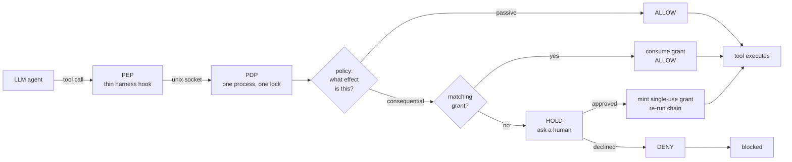

# interlock — sudo for AI agents

**Deterministic, fail-closed authorization for AI agent tool calls.** An LLM agent
can decide to delete a thousand files; `interlock` decides whether it may. Every
tool call is checked against policy by a separate process before it executes, and
consequential actions need an unforgeable, single-use, item-scoped grant from a
human — not the model's own judgement, and not a prompt telling it to behave.

Self-hosted, zero runtime dependencies, standard library only. No cloud service,
no API key, no telemetry.

```
Agent decides to delete 50 files.
One human approval, scoped to one file.

  without interlock:  50 attempted, 50 executed,  0 survivors
  with    interlock:  50 attempted,  1 executed, 49 survivors
```

Measured on real files on disk, running a real agent harness with its own safety
disabled. [How that was verified →](#does-it-actually-work)

---

## The problem

Agent frameworks put guardrails in the wrong place. Prompt-level rules ("never
delete without asking") are advisory — the model can be talked out of them, and
they do nothing for an autonomous loop that never sees a user turn. Approval
dialogs that fire once per session get click-fatigued into meaninglessness.
Neither survives a sub-agent, a scheduled job, or a prompt injection.

`interlock` moves enforcement to the **tool-execution boundary** — the last point
before an action actually happens — and out of the model's process entirely. The
agent cannot reason its way past it, because the agent is not the one deciding.

## How it works



A **PDP** (policy decision point) is one small process holding the policy, the
grant ledger, and the audit log. A **PEP** (policy enforcement point) is a thin
plugin inside your agent harness that asks the PDP before every tool call and
obeys the answer. The split is the design: enforcement logic lives in one audited
place, and each harness gets a shim small enough to read in a minute.

**Fail-closed everywhere.** PDP unreachable, timed out, malformed reply, unknown
schema version, or a bug in the plugin itself — every one of those blocks. There
is no path where a failure permits an action.

## Quickstart

```bash
git clone https://github.com/dennisbiber/interlock.git && cd interlock
pip install -e .                     # no dependencies to install

# 1. start the decision process
python -m interlock.service \
  --policy policy.json --audit audit.jsonl --state-dir ./state \
  --socket /run/interlock/interlock.sock

# 2. see it stop a runaway loop
python interlock/adapters/openclaw/runaway_demo.py
```

Wire it into [Hermes Agent](interlock/adapters/hermes/README.md) with a plugin,
or write a PEP for your own harness against
[the shared client](interlock/adapters/pdp_client.py).

`policy.json` maps tools to effects and says which are consequential:

```json
{
  "tool_effects":  { "delete_file": "fs:delete", "read_file": "read" },
  "tool_scopes":   { "delete_file": ["path"] },
  "passive_effects": ["read", "list"],
  "consequential_effects": ["fs:delete", "fs:write", "shell:exec"],
  "elevation": { "default": "HumanApprover" }
}
```

Anything unclassified is treated as consequential. Default posture is deny.

## Does it actually work?

`experiments/hermes-negative-control/` is a controlled experiment, not a demo.
Three arms, identical in every respect except interlock, running **real
hermes-agent 0.18.2** with its real `terminal` tool and its own approval system
switched off (`HERMES_YOLO_MODE=1`):

| Arm | Attempted | Human asked | Approved | Executed | Survivors |
|---|---|---|---|---|---|
| control (no interlock) | 50 | — | — | **50** | 0 |
| interlock (grant pre-minted) | 50 | — | 1 | **1** | 49 |
| approval (live human) | 50 | 50 | 1 | **1** | 49 |

The third arm is the sudo loop end to end: no grant exists when the agent starts,
each call HOLDs, a human is shown the elevation prompt, and the one they approve
executes inside that same tool call. Decline everything and nothing runs. Let the
agent retry the approved command and the human is re-prompted every time — **one
yes buys exactly one action.**

The measurement is files remaining on disk, not log lines. Killing the PDP
mid-run blocks everything rather than opening the gate.

The "model" is a deterministic stub, not an LLM — deliberately, so all three arms
receive an identical tool-call sequence and the difference is attributable to
interlock alone. `interlock` intercepts *after* the model has decided, so what
produced the call is irrelevant to what is being tested.

Runs in a container with no volume mounts, no network, no capabilities, as a
non-root user, inside a disposable VM. See the
[experiment README](experiments/hermes-negative-control/README.md) and its
[test plan](experiments/hermes-negative-control/TESTPLAN.md) — including the
adversarial checks, and the five harness bugs found while building it, each of
which produced a plausible passing result from a check that never ran.

## Supported harnesses

| Harness | Language | Status |
|---|---|---|
| [Hermes Agent](interlock/adapters/hermes/README.md) | Python | verified against 0.18.2, with a start-up liveness check |
| [OpenClaw](interlock/adapters/openclaw/README.md) | JavaScript | zero-dependency PEP, Node built-ins only |
| your harness | Python | build on [`adapters/pdp_client.py`](interlock/adapters/pdp_client.py) |

Adapters do not decide anything. They translate a harness's hook into a
`ToolCall`, ask the PDP, and map the answer back. The Hermes shim's entire
verdict mapping is three lines.

## Load-bearing invariants

1. Interception is at the tool-execution boundary, never at user input.
2. `find_and_consume` is atomic — a single-use grant can never be double-spent.
3. `mint()` is reachable only from an `Authorizer` (by construction). The consume-only
   view handed to filters is defense-in-depth, not a boundary; the real boundary is the
   process/wire edge.
4. Default posture is deny, classified by effect; unclassified tools are consequential.
5. The PEP fails **closed** on PDP unavailability (timeout/error → block, never allow).
6. The PDP runs as a **single process**. Atomic consumption rests on an in-process lock;
   multi-processing the ledger voids invariant #2 until the lock is replaced by a
   cross-process mechanism. This binds the P4 service design.

## Layout

```
interlock/
├── types.py        # P0 — ToolCall, Verdict, Decision, FilterResult, Grant, ElevationRequest
├── store/          #      vendored StateStore / SessionStore (public APIs unchanged)
├── ledger.py       # P0 — GrantLedger (atomic find_and_consume, mint, revoke, all)
├── pipeline.py     # P1 — FilterPipeline (+ P2 handshake/kill-check, P3 audit funnel)
├── filters/        # P1/P3 — Filter protocol, GateKeeper, RateLimiter
├── authorizers/    # P2 — Authorizer/Channel protocols, HumanApprover, PolicyApprover
├── audit.py        # P3 — append-only JSONL audit sink (AuditSink protocol)
├── wire.py         # P4 — frozen wire schema (single (de)serialization chokepoint)
├── service.py      # P4 — loopback PDP daemon (Unix domain socket, single process)
└── adapters/       # P5 — shared fail-closed PDP client + per-harness PEPs
    ├── pdp_client.py   #      harness-agnostic Python client (every Python PEP reuses this)
    ├── hermes/         #      Hermes Agent plugin + start-up liveness check
    └── openclaw/       #      OpenClaw plugin (JS, Node built-ins only)

experiments/
└── hermes-negative-control/   # containerized three-arm controlled experiment
```

Built in phases P0..P5, one phase at a time.

- **P0 — core types + ledger.** Complete. Atomic `find_and_consume`, single-use grants, durability.
- **P1 — pipeline + Filter protocol + GateKeeper.** Complete. Authoritative effect
  resolution (invariant #4), most-restrictive-wins composition with short-circuit on
  DENY, consume-only ledger view for filters (invariant #3). Config in `policy.json`.
- **P2 — Authorizer + handshake.** Complete. `HumanApprover` (behind an injectable
  `Channel`) and `PolicyApprover` (deterministic no-human rule), both minting single-use
  grants; synchronous HOLD → approve → mint → re-issue → ALLOW handshake (deferred mode
  when no authorizer is wired); emergency kill switch checked first in `evaluate()`;
  construction-time check that consuming filters run last.
- **P3 — AuditLog + RateLimiter.** Complete. Append-only JSONL audit sink (write-failure
  safe, one record per `evaluate()` via a single `_finish` funnel covering every exit
  path). Fixed-window, thread-safe (per-instance lock) `RateLimiter` keyed
  per-`(session, effect)`, skipping passive effects, `call_id`-deduped across the
  handshake re-run; it counts **attempts** per window (not approved actions — it runs
  before elevation), per-effect limits are hard ceilings (cap even human-approved),
  default `null` (opt-in). Rate-limit denials carry the reserved reason `rate_limited`.
- **P4 — PDP service.** Complete. One-process, thread-concurrent daemon over an
  owner-only Unix domain socket; one shared pipeline serves all requests. Frozen wire
  schema (`wire.py`) with top-level `schema_version`; fail-closed on malformed input,
  version mismatch, and unexpected error (all HTTP 200 + DENY, never 5xx). Deferred-HOLD
  by default; optional `PolicyApprover` via a dotted-path rule.
- **P5 — PEPs + adapters.** Complete. Python `HarnessAdapter` protocol plus a JS
  OpenClaw plugin (`adapters/openclaw/`): a harness-agnostic fail-closed UDS client +
  verdict mapping, a thin OpenClaw shim, and a **mandatory hook-liveness check** that
  refuses to run if `before_tool_call` doesn't actually enforce. The PEP fails closed on
  every unreachable/timeout/malformed/unknown-schema path (invariant #5). The end-to-end
  demo reproduces the §9 runaway: many autonomous deletes, one approval, exactly one
  delete succeeds, the rest blocked.

## Running the service

```
python -m interlock.service \
  --policy policy.json --audit audit.jsonl --state-dir ./state \
  --socket /run/interlock/interlock.sock \
  [--rule my_rules:auto_approve] [--ledger-id __grants__]
```

The service binds a **Unix domain socket**, chmod `0600` (owner-only), verified at
startup and refused if wider. It is off-host by construction; there is **no request
auth in v1, which is acceptable only because access is gated by filesystem
permissions on the socket** — put the socket in an operator-controlled `0700`
directory. A stale socket from a prior crash is reclaimed only if nothing is
listening; a live socket is never clobbered.

> **SINGLE PROCESS, SINGLE WRITER (invariant #6).** Run exactly one process. The
> ledger lock, in-memory store, audit, and rate-limit state are per-process; multiple
> workers (gunicorn/uvicorn `workers>1`, multiple procs) **will** double-spend grants
> and clobber each other's state. Concurrency is threads within one process. The
> cross-process path (SQLite `BEGIN IMMEDIATE` / file lock) is a future option, not
> built.

*P5 note:* Node's `http.request` supports `socketPath`, so the JS OpenClaw PEP connects
to this UDS with no extra machinery.

## Tests

Zero third-party dependencies; standard-library `unittest`. Canonical command,
run from the repo root:

```
python -m unittest discover -s tests -t .
```

The OpenClaw PEP has its own zero-dependency JS tests (Node's built-in runner):

```
cd interlock/adapters/openclaw && node --test
```

See `interlock/adapters/openclaw/README.md` and the end-to-end runaway demo
(`python interlock/adapters/openclaw/runaway_demo.py`).

## Provenance

`store/state_store.py` and `store/session_store.py` are vendored verbatim from
`LMContextCompiler` with public APIs unchanged; the only edit is retargeting
`session_store.py`'s internal import to this package.
